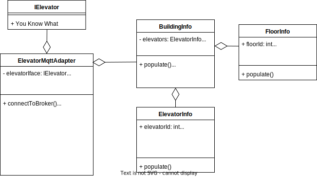
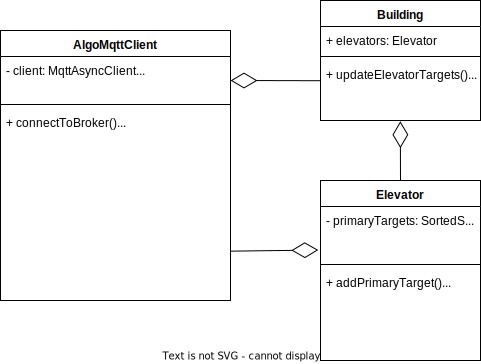
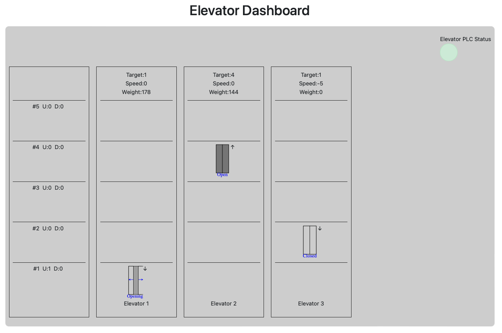

# sqelevator-proj

# Setup and Run

## Requirements
- docker-compose
- Elevator Sim
  - **IMPORTANT NOTE:** Set `-Djava.rmi.server.hostname=host.docker.internal` in the startup call of the elevator sim. Note the parameter must be passed **before** the class parameter
      - e.g. `java -cp "${CLASS_PATH}" -Djava.rmi.server.hostname=host.docker.internal elevator.Challenge "$@"`

## Run

```sh
docker-compose up
```
The GUI should now be available under `http://localhost`

# System Documentation

## Elevator Adapter

## Elevator Algorithm


## Product Quality 
- **Automated Tests** as shown done with every push and merge by **GitHub Action**
- **Static Code Analysis** done with every push and merge by **SonarCloud**
- **Code** done individually was **reviewed by** at least one **colleague** with GitHub Pull Request
- Issue Management was done by talking with colleague, which then was solved and with a GitHub Pull Request merged into Master

### Automated Testing

The Tests were mostly done as White Box Tests, where the main focus was on Branchcoverage due to functionality. The overall result is as shown: 


After running the automated testcases, the jacoco testprotocol with the results will be placed at: 
[Jacoco-Testprotocol](/target/site/jacoco/index.html)

### Elevator Adapter Testing

- Automated tests are done in a Docker Container
- HiveMQ Docker Container as MQTT Broker
- Testing focuses on branches due the logic
- Coverage is low due to avoiding RMI connection in testing


### Datatypes for Elevator Adapter 
- Simple Unit testing with Focus on functionality


 
### Elevator Algorithm Testing

- Automated tests are done in a Docker Container
- HiveMQ Docker Container as MQTT Broker
- Testing focuses on branches due the logic


### Simple Statemachine for Elevator
The help with creation of the testcases for the Elevator and Building class this simple statemachine was used.


## GUI


The GUI is used as a status dashboard. It connects to the MQTT broker and initially renders representative schematic of the build, including the elevators and floors. Afterwards it observes various system states and parameters, like
the elevators current floor, committed direction, target floor, door status, current weight and current speed.  In addition, the status (pressed or not pressed) of the floor buttons is also displayed. The GUI provides an intuitive insight into the 
the entire system and how the algorithm carries out its planning.

The GUI is available as responsive web app and can be served by any modern browser (PC, Smartphone, Table, etc.), without additional installations.
On the host machine it is available under http://localhost

# Development Documentation

## MQTT Topics
Common topics:  
```
    building/info/numberOfElevators
    building/info/numberOfFloors
    building/info/floorHeight/feet
    building/info/systemClockTick
    building/info/rmiConnected
```

Elevator topics:  
```
    building/status/elevator/{id}/committedDirection
    building/status/elevator/{id}/acceleration/feetPerSqSec
    building/status/elevator/{id}/floorButton/{id}
    building/status/elevator/{id}/door
    building/status/elevator/{id}/floor
    building/status/elevator/{id}/position/feet
    building/status/elevator/{id}/speed/feetPerSec
    building/status/elevator/{id}/load/lbs
    building/info/elevator/{id}/floorService/{id}
    building/info/elevator/{id}/targetFloor
    building/info/elevator/{id}/maxPassengers
    building/control/elevator/{id}/committedDirection
    building/control/elevator/{id}/floorService/{id}
    building/control/elevator/{id}/targetFloor
```

Floor topics:  
```
    building/status/floor/{id}/button/up
    building/status/floor/{id}/button/down
```

## Doc:

```sh
# generate Javadoc
mvn javadoc:javadoc
```
The documentation can be found under `target/site/apidocs`

## MQTT Broker
1. Install docker
2. docker run -it -p 1883:1883 -p 9001:9001  eclipse-mosquitto:latest


